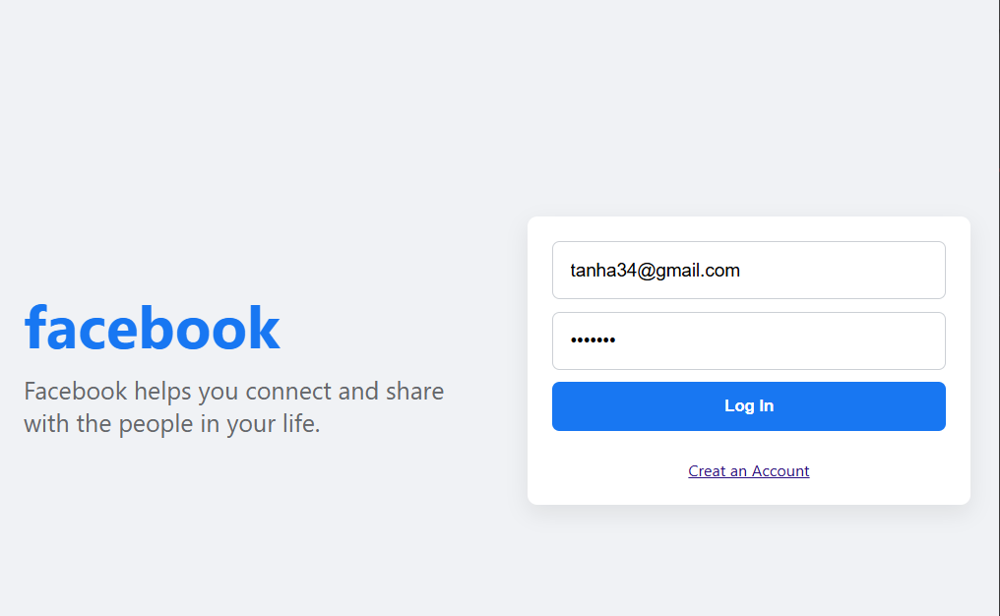
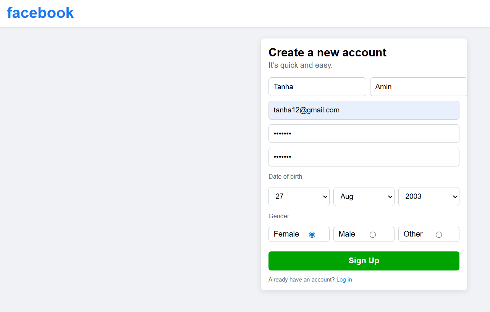
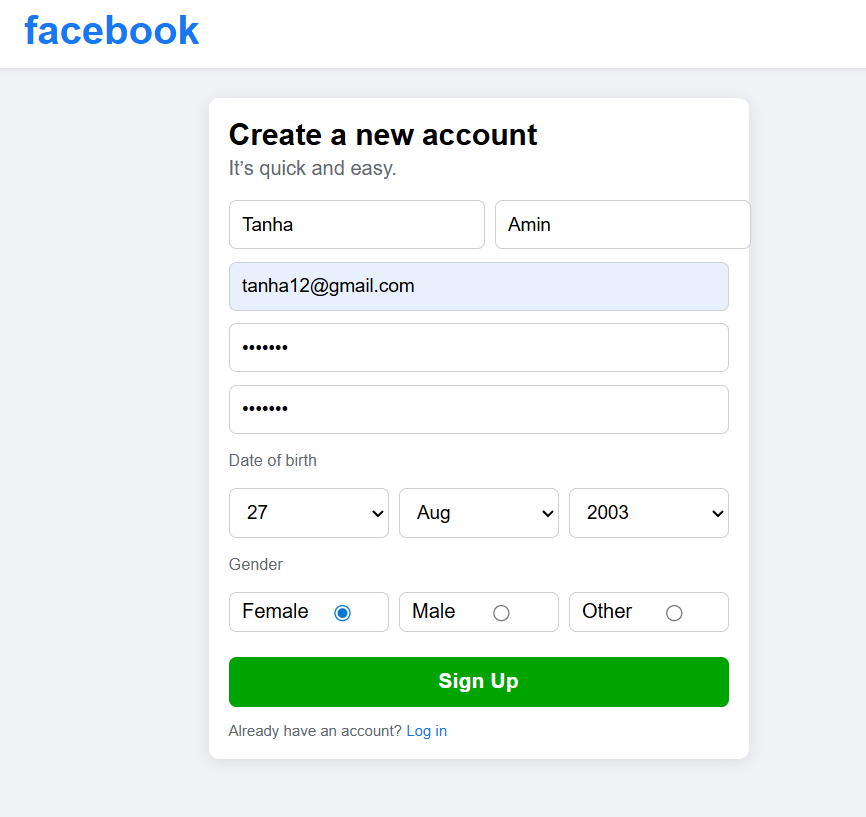
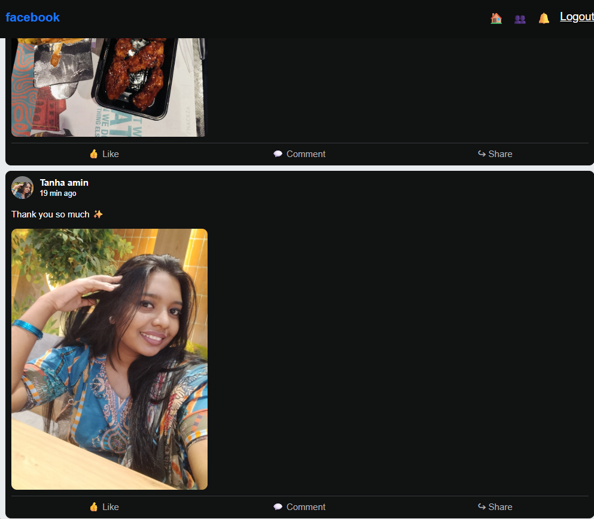

# django-facebook-login-system
"User registration and login system in Django, inspired by Facebook authentication."

run the project : cd "C:\Users\Asus\Django project\registration"
>> python manage.py runserver
## 📸 Screenshots
### 🔐 Login Page

### 🔐 Signup Page

### 🏠 Home Page

  
  
    
    
    
     

